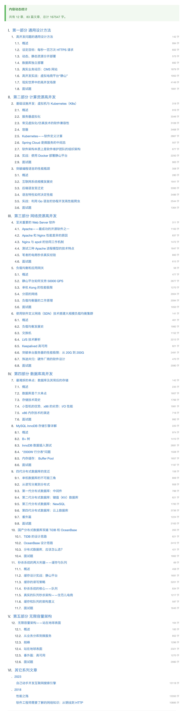
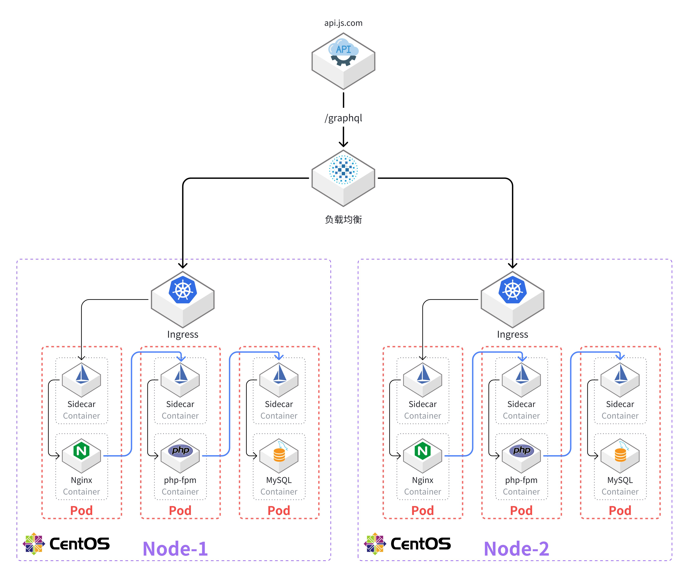
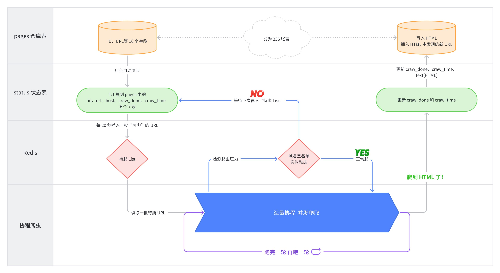
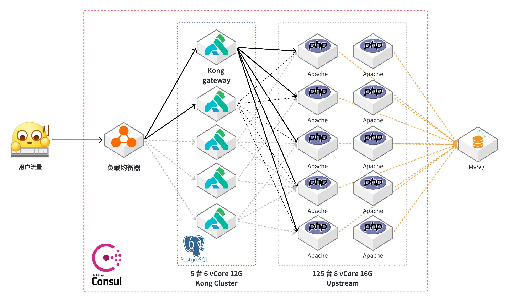
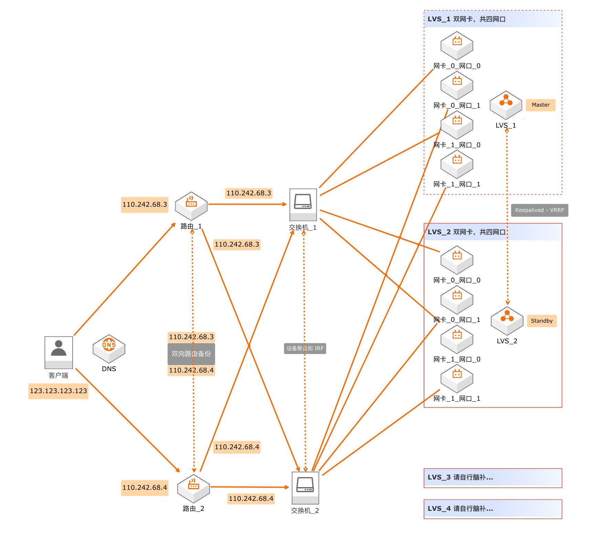
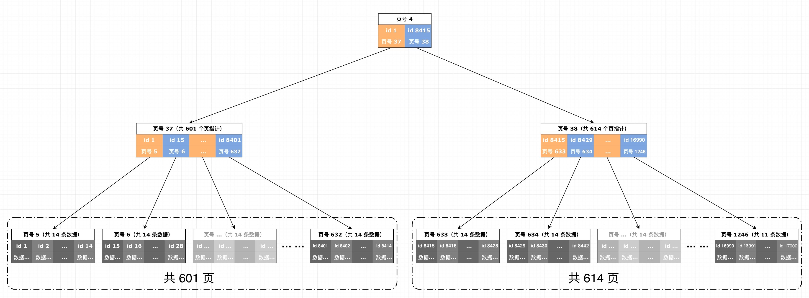
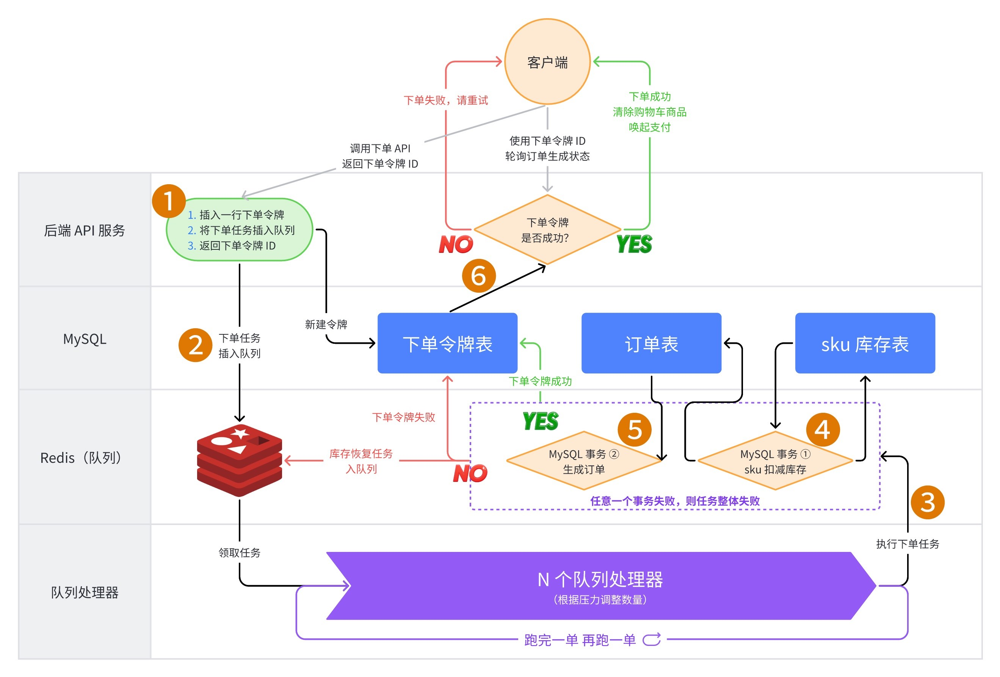

  

<h3 align="center">《高并发的哲学原理 Philosophical Principles of High Concurrency》</h3>
<h3 align="center">简称 <code>PPHC</code></h3>

    

        

            <h3>纸质书已经出版</h3>
            
实体书版本新增了 AI 架构、高可用、分布式理论与工程化体系等内容。

        

        
电子工业出版社

    

    

        

            
        

        

            
纸质书新增内容

            <ul>
                <li>紧跟时代的 <b>"AI 架构"</b> 与前沿技术</li>
                <li>系统化的 <b>"高可用"</b> 与 <b>"分布式理论"</b></li>
                <li>完整阐述了 <b>"工程化体系"</b> 与 <b>"方法论"</b></li>
                <li>更加硬核的 <b>"底层原理"</b> 深挖</li>
                <li>实战项目 <b>"全栈式"</b> 落地</li>
            </ul>
        

        

            

                
            

            

                

                    
全新塑封 / 作者签名版

                    

                      作者直销
                    

                    
扫码购买 ¥55

                    

                

                

                    <a href="https://item.jd.com/14642937.html" target="_blank">🛒 京东购买 ¥67.6</a>
                

            

        

    

### 开源版本阅读地址：https://pphc.lvwenhan.com

**pdf 下载链接在网站右上角。**

### 写作目标

本书的目标是在作者有限的认知范围内，讨论一下高并发问题背后隐藏的一个哲学原理——找出单点，进行拆分。

### 内容梗概

我们将从动静分离讲起，一步步深入 Apache、Nginx、epoll、虚拟机、k8s、异步非阻塞、协程、应用网关、L4/L7 负载均衡器、路由器(网关)、交换机、LVS、软件定义网络(SDN)、Keepalived、DPDK、ECMP、全冗余架构、用户态网卡、集中式存储、分布式存储、PCIe 5.0、全村的希望 CXL、InnoDB 三级索引、内存缓存、KV 数据库、列存储、内存数据库、Shared-Nothing、计算存储分离、Paxos、微服务架构、削峰、基于地理位置拆分、高可用等等等等。并最终基于地球和人类社会的基本属性，设计出可以服务地球全体人类的高并发架构。

开源版本共有 12 章，83 篇文章，总计 167547 字。

### 读者评价

> 会上一谈到架构和 I/O，我都想到你的文章。主讲解答清楚和没解答清楚的，都没你的文章清楚。
>
> —— 秋收，于 RubyConf 2023

---

> 像看小说一样把文章都看完了，全程无尿点，作者的脑袋是在哪里开过光，知识储备竟如此扎实
>
> —— 观东山

---

> 非常棒的技术分享！深入浅出，娓娓道来，让我想起了那本 csapp。
>
> —— drhrchen

---

> 写得真好，膜拜！作者愿意出书吗，一定买！
>
> —— bean

---

> 拜读了！应该算是架构顶级总结！！
>
> —— 雨山前

---

> 看完了 博主好厉害 学习到了各种骚技巧 和知识 膜拜
>
> —— evanxian

---

> 写的太好了，不仅充满了理工科的严谨较真，也充满了文科的浪漫
>
> —— 一秒

---

> 写得很好，视角也是我喜欢的，站在地球表面，述事宏大，思维自信。
>
> —— 纳秒时光

---

> 全部看完，博主太强了，很受启发
>
> —— Bruce

---

> 棒
>
> —— JuniaWonter

### 作者信息：

1. 姓名：吕文翰
2. GitHub：[johnlui](https://github.com/johnlui)
3. 职位：住范儿创始成员，CTO，监事

#### 高并发系统处理经验

1. 2017 年维护的单体 CMS 系统顶住了每日两百万 PV 的压力
2. 2020 年优化一个单机 PHP 商城顶住了 QPS 1000+ 的压力
3. 2021 年设计的分布式电商秒杀系统在实际业务中跑到了最高一分钟 GMV 500 万，QPS 10000+

### 目录

### 精彩图片摘录

### 版权声明

本书版权归属于[吕文翰](https://github.com/johnlui)，采用 [CC BY-NC-ND 4.0](https://creativecommons.org/licenses/by-nc-nd/4.0/legalcode.zh-Hans) 协议开源，供 GitHub 平台用户免费阅读。

